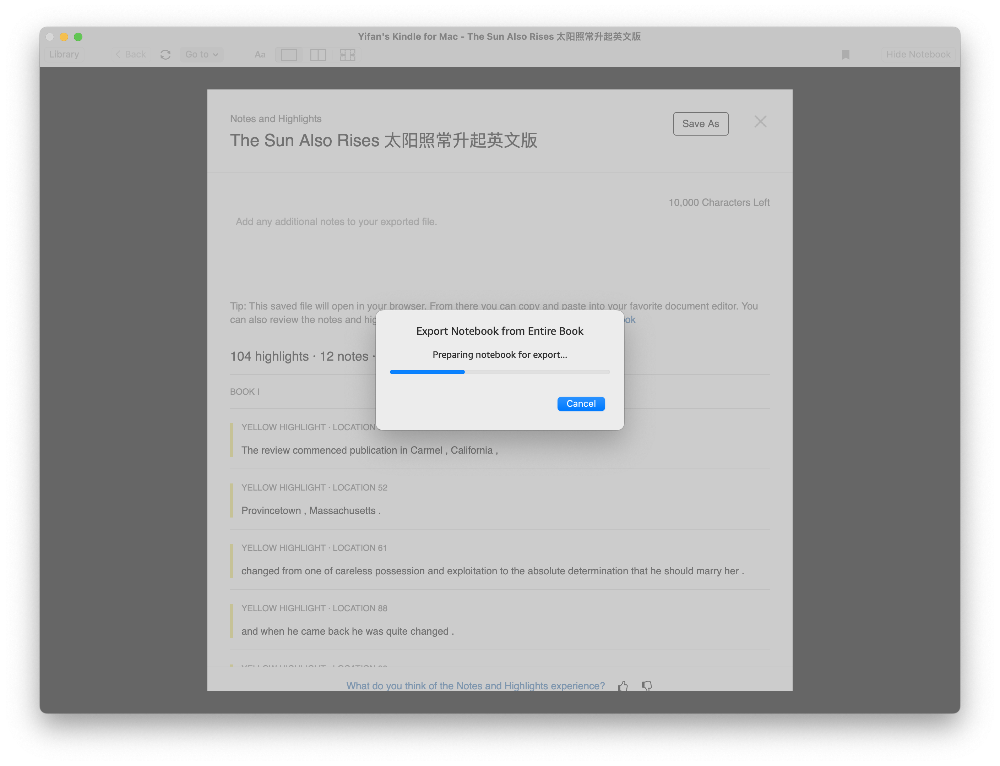
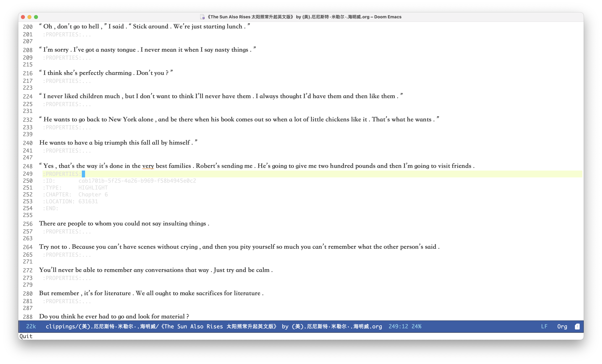
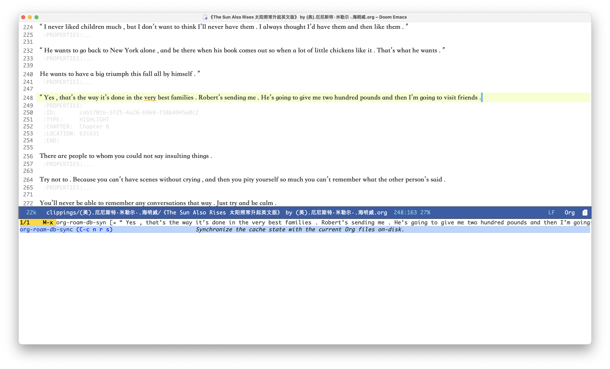
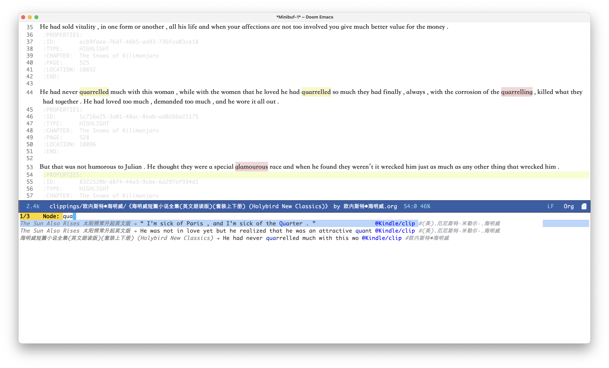

blueNote 
============
A Notes/Clippings Browser


## Build

```
git clone git@github.com:yifan-gu/blueNote.git && go build
./blueNote -h
```

## Usage

#### Export notes as html using the Kindle App



#### Convert notes to JSON and display them in the console
```
./blueNote convert -i kindle-html -o json --json.pretty examples/kindle_html_single_book_example.html
```

#### Convert notes and store them into MongoDB
```
./blueNote convert -i kindle-html -o mongodb examples/kindle_html_single_book_example.html
```

#### Convert notes to org-roam files and save to the current dir
```
./blueNote convert -i kindle-html -o org-roam examples/kindle_html_single_book_example.html ./
```

#### Add `-s` if the book is a collection of multiple books
```
./blueNote convert -i kindle-html -o json --json.pretty -s examples/kindle_html_collection_example.html
```

#### Browse and edit the notes with tags with Emacs Org


#### Remember to run `M-x org-roam-db-sync` to sync the org-roam database


#### 📖 Happy Notes Searching! 📖



### References

- Doom Emacs: https://github.com/doomemacs/doomemacs
- Org-roam: https://www.orgroam.com/
- My Doom Emacs config: https://github.com/yifan-gu/.doom
- A [custom Emacs theme](https://github.com/yifan-gu/.doom/blob/master/themes/org-leuven-theme.el) I made for Org-roam mode based on [leuven](https://github.com/fniessen/emacs-leuven-theme)


## TODO
Documentation
- [ ] Update README to reflect the json/mongodb based usage

Emacs org roam related:
- [ ] <s>[Dropped] Roam module (fix bug)</s>
- [ ] <s>[Dropped] Check roam version</s>

Parser/Exporter:
- [x] Refactor book module
- [x] Refactor configs for parser and exporter
- [x] Fix location output
- [x] Fix user notes content
- [x] JSON exporter
- [x] Optional author, title flag
- [x] Stacktrace error
- [x] List parsers and exporters
- [x] MongoDB exporter
- [x] JSON parser
- [ ] One click export from Kindle app
- [ ] Change parser/exporter type from string to safe type

Server Backend:
- [x] Database storage
- [ ] <s>Index, unique on digest</s>
- [x] Update storage interface
- [ ] <s>Recompute digest</s>
- [x] Limit on return marks
- [x] Timestamp(created, last modified)
- [ ] Server REST API?
- [x] Graphql API READ
- [x] Graphql API Create
- [x] Graphql API Update
- [x] Graphql API Delete
- [ ] Handle Graphql null fields?
- [ ] Graphql API tests, mocked storage

App:
- [ ] Create DB scheme for users
- [ ] Search by tags, keywords, book, author
- [ ] Show random notes/highlights every time
- [ ] Show connected notes
- [ ] Clickable with tags, book, author
- [ ] Manual update tags
- [ ] Ratings?
- [ ] Audio book
- [ ] Generate tags automatically
- [ ] Connected notes suggestion

Advanced functions:
- [ ] User ratings
- [ ] User comments?
- [ ] User profiles
- [ ] User upload audiobook readings?
